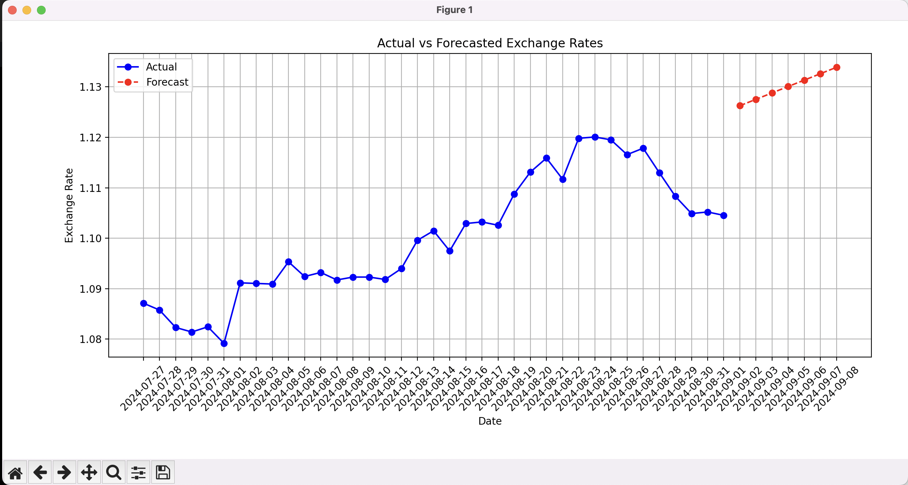

# Currency Exchange Rate Forecasting

## Overview

This project is designed to download historical exchange rates for EUR/USD, build a forecasting model using the last 7 days as a validation dataset, and predict the exchange rates for the next 7 days. Additionally, the project generates a plot that visualizes both the actual and forecasted exchange rates.

## Project Structure

- **modules/fetch**: Contains functions for fetching historical exchange rate data from a public API.
- **modules/forecast**: Contains configuration parameters for the forecasting model.
- **modules/plot**: Contains functions for plotting the actual and forecasted exchange rates.
- **main.py**: The entry point of the project, orchestrating the fetching of data, forecasting, and plotting.

## Installation

To run this project, you need to have Python installed on your system along with the necessary libraries.

1. Clone the repository or download the project files.
2. Install the required libraries using pip:

```bash
pip install -r requirements.txt
```

## Environment Variables

For the project to work correctly, you need to have the following environment variable set:

- **CURRENCY_RATE_APIKEY**: This is your API key for accessing the freecurrencyapi.com service.

You can set it in your environment using the following command:

```bash
export CURRENCY_RATE_APIKEY="your_api_key_here"
```

## Usage

To run the project, simply execute the `main.py` script:

```bash
python main.py
```

This will:
1. Fetch historical exchange rates for the last month + 7 days.
2. Use the last 7 days as a validation dataset to build a forecasting model.
3. Predict the exchange rates for the next 7 days.
4. Generate and display a plot showing both the actual and forecasted exchange rates.

## Example Output

The output will be a printed forecast in the console and a plot similar to the one below:

- **Blue Line**: Actual exchange rates.
- **Red Line**: Forecasted exchange rates.

